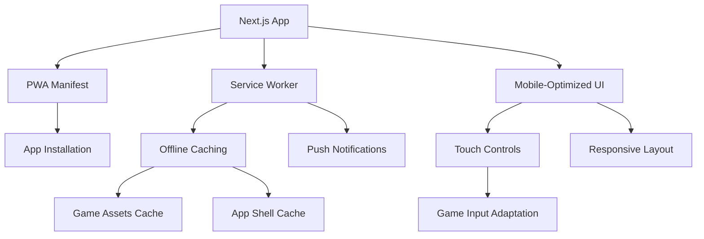

# Mobile PWA Support Design Document

## Overview

This design document outlines the implementation of Progressive Web App (PWA) capabilities for the game portal, enabling mobile-optimized gameplay and native app-like experiences. The solution leverages Next.js's built-in PWA support capabilities, service workers for offline functionality, and responsive design patterns for optimal mobile gaming.

## Architecture

### PWA Core Components



### Service Worker Strategy

- **App Shell**: Cache the main application shell (HTML, CSS, JS) using Cache First strategy
- **Game Assets**: Cache game files (images, sounds, game scripts) using Stale While Revalidate
- **API Calls**: Use Network First with fallback to cache for dynamic content
- **Static Assets**: Use Cache First for images and other static resources

## Components and Interfaces

### 1. PWA Configuration

**Manifest Configuration (`manifest.json`)**
```typescript
interface PWAManifest {
  name: string;
  short_name: string;
  description: string;
  start_url: string;
  display: 'standalone' | 'fullscreen';
  orientation: 'portrait' | 'landscape' | 'any';
  theme_color: string;
  background_color: string;
  icons: ManifestIcon[];
  categories: string[];
}
```

**Service Worker Registration**
```typescript
interface ServiceWorkerConfig {
  scope: string;
  updateViaCache: 'imports' | 'all' | 'none';
  skipWaiting: boolean;
}
```

### 2. Mobile Game Adapter

**Touch Input Handler**
```typescript
interface TouchInputAdapter {
  adaptKeyboardControls(gameElement: HTMLElement): void;
  enableTouchGestures(gameElement: HTMLElement): void;
  handleOrientationChange(): void;
  optimizeViewport(gameConfig: GameConfig): void;
}

interface GameConfig {
  width: number;
  height: number;
  scaleMode: 'fit' | 'fill' | 'stretch';
  touchControls: TouchControlConfig[];
}
```

**Mobile Game Wrapper Component**
```typescript
interface MobileGameWrapperProps {
  gameId: string;
  gameConfig: GameConfig;
  onGameLoad: () => void;
  onGameError: (error: Error) => void;
}
```

### 3. Offline Game Manager

**Cache Strategy Interface**
```typescript
interface GameCacheManager {
  cacheGameAssets(gameId: string): Promise<void>;
  isGameAvailableOffline(gameId: string): Promise<boolean>;
  getOfflineGames(): Promise<string[]>;
  clearGameCache(gameId: string): Promise<void>;
}
```

### 4. Push Notification Service

**Notification Manager**
```typescript
interface NotificationManager {
  requestPermission(): Promise<NotificationPermission>;
  subscribeToNotifications(): Promise<PushSubscription>;
  sendNotification(title: string, options: NotificationOptions): void;
  handleNotificationClick(event: NotificationEvent): void;
}
```

### 5. Mobile-Optimized Components

**Mobile Navigation**
```typescript
interface MobileNavProps {
  isInstalled: boolean;
  onInstallPrompt: () => void;
}
```

**Touch-Optimized Game Grid**
```typescript
interface MobileGameGridProps {
  games: Game[];
  onGameSelect: (gameId: string) => void;
  offlineGames: string[];
}
```

## Data Models

### Game Metadata Enhancement

```typescript
interface Game {
  id: string;
  title: string;
  description: string;
  thumbnail: string;
  category: string;
  // PWA-specific fields
  mobileOptimized: boolean;
  offlineSupported: boolean;
  touchControlsRequired: boolean;
  minScreenSize: {
    width: number;
    height: number;
  };
  preferredOrientation: 'portrait' | 'landscape' | 'any';
}
```

### PWA Installation State

```typescript
interface PWAState {
  isInstalled: boolean;
  isInstallable: boolean;
  installPromptEvent: BeforeInstallPromptEvent | null;
  notificationPermission: NotificationPermission;
  isOnline: boolean;
  offlineGamesCount: number;
}
```

### Cache Metadata

```typescript
interface CacheEntry {
  gameId: string;
  cachedAt: Date;
  version: string;
  size: number;
  assets: string[];
}
```

## Error Handling

### PWA Installation Errors
- Handle unsupported browsers gracefully
- Provide fallback experience for non-PWA capable devices
- Show appropriate error messages for installation failures

### Offline Game Loading
- Display clear offline indicators
- Handle cache misses with user-friendly messages
- Provide retry mechanisms for failed cache operations

### Touch Input Adaptation
- Fallback to default controls if touch adaptation fails
- Handle orientation change errors
- Manage viewport scaling issues on different devices

## Testing Strategy

### PWA Functionality Tests
```typescript
describe('PWA Installation', () => {
  test('should show install prompt on supported devices');
  test('should register service worker successfully');
  test('should cache app shell on first visit');
  test('should work offline after initial cache');
});
```

### Mobile Game Adaptation Tests
```typescript
describe('Mobile Game Adaptation', () => {
  test('should adapt keyboard controls to touch');
  test('should handle orientation changes');
  test('should scale games properly on different screen sizes');
  test('should maintain 60fps on mobile devices');
});
```

### Offline Functionality Tests
```typescript
describe('Offline Functionality', () => {
  test('should cache game assets for offline play');
  test('should show offline indicator when disconnected');
  test('should list available offline games');
  test('should sync data when connection restored');
});
```

### Performance Tests
```typescript
describe('Mobile Performance', () => {
  test('should load app shell within 3 seconds on 3G');
  test('should preload critical game assets');
  test('should maintain smooth scrolling on game grid');
  test('should handle memory constraints on mobile devices');
});
```

### Cross-Device Testing
- Test on various mobile devices (iOS, Android)
- Test different screen sizes and orientations
- Test touch interactions across all games
- Validate PWA installation on different browsers

### Accessibility Testing
- Ensure touch targets meet minimum size requirements
- Test with screen readers on mobile devices
- Validate color contrast for mobile viewing
- Test keyboard navigation fallbacks