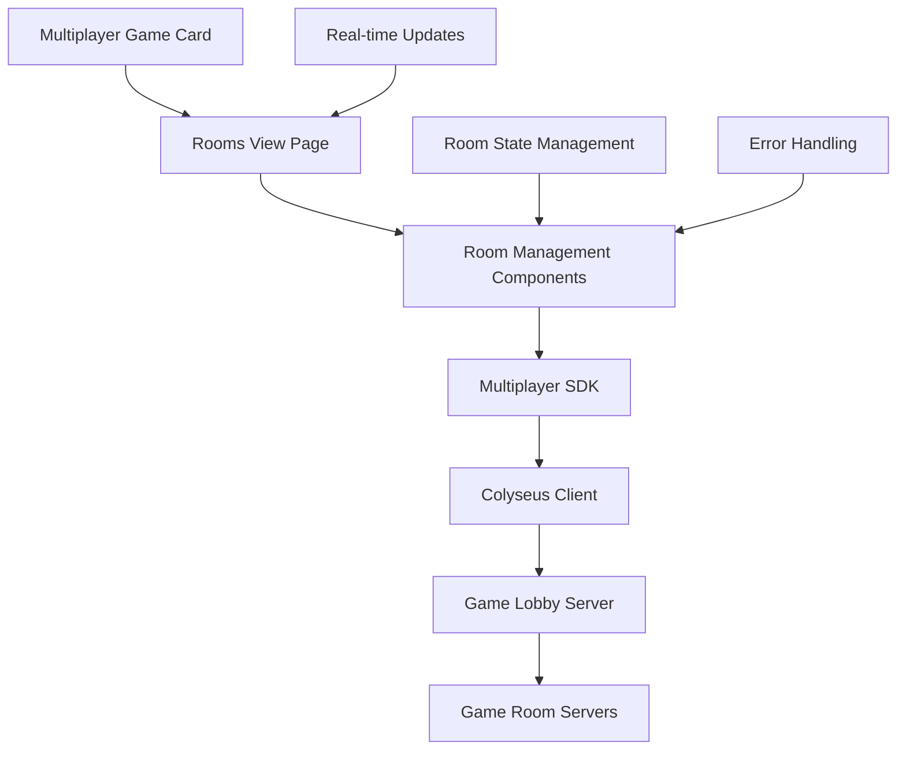

# Design Document

## Overview

The Multiplayer Rooms View feature creates a dedicated interface for managing multiplayer game rooms when users click on multiplayer game cards. This system integrates with the existing Colyseus-based multiplayer infrastructure to provide real-time room discovery, creation, and joining capabilities. The design leverages the current GameLobby system and extends the existing MultiplayerGameCard component to provide a seamless room management experience.

## Architecture

### System Architecture



### Component Hierarchy

```
MultiplayerGameCard
├── onClick → Navigate to RoomsView
│
RoomsView (/games/{gameId}/rooms)
├── RoomsList
│   ├── RoomCard (multiple)
│   └── EmptyRoomsState
├── CreateRoomModal
│   ├── RoomConfigForm
│   └── RoomCreationActions
├── JoinByCodeModal
│   └── CodeInputForm
├── LoadingStates
└── ErrorBoundary
```

### Data Flow

1. **Room Discovery**: Client connects to GameLobby → Receives real-time room updates
2. **Room Creation**: User configures room → SDK creates room → Lobby tracks room → Real-time broadcast
3. **Room Joining**: User selects room → SDK validates capacity → Joins room → Redirects to game
4. **Real-time Updates**: Lobby broadcasts room changes → All clients update UI automatically

## Components and Interfaces

### Core Components

#### 1. RoomsView Page Component
```typescript
interface RoomsViewProps {
  gameId: string;
  gameName: string;
  gameInfo: GameInfo;
}

interface RoomsViewState {
  rooms: ActiveRoom[];
  isLoading: boolean;
  error: string | null;
  isConnected: boolean;
  showCreateModal: boolean;
  showJoinByCodeModal: boolean;
}
```

**Responsibilities:**
- Manage connection to GameLobby
- Handle real-time room updates
- Coordinate room operations (create, join, refresh)
- Manage modal states and navigation

#### 2. RoomCard Component
```typescript
interface RoomCardProps {
  room: ActiveRoom;
  gameInfo: GameInfo;
  onJoinRoom: (roomId: string) => void;
  isJoining: boolean;
}

interface ActiveRoom {
  roomId: string;
  roomCode: string;
  gameId: string;
  playerCount: number;
  maxPlayers: number;
  state: 'LOBBY' | 'COUNTDOWN' | 'PLAYING' | 'RESULTS';
  isPrivate: boolean;
  createdAt: number;
}
```

**Features:**
- Display room information (code, players, status)
- Join button with capacity validation
- Visual indicators for room state
- Responsive design for mobile/desktop

#### 3. CreateRoomModal Component
```typescript
interface CreateRoomModalProps {
  gameInfo: GameInfo;
  isOpen: boolean;
  onClose: () => void;
  onCreateRoom: (options: RoomCreationOptions) => Promise<void>;
}

interface RoomCreationOptions {
  isPrivate: boolean;
  maxPlayers: number;
  gameSettings: Record<string, any>;
  roomName?: string;
}
```

**Features:**
- Room privacy toggle (public/private)
- Player count selection
- Game-specific settings configuration
- Room name customization (optional)

#### 4. JoinByCodeModal Component
```typescript
interface JoinByCodeModalProps {
  isOpen: boolean;
  onClose: () => void;
  onJoinByCode: (code: string) => Promise<void>;
  isJoining: boolean;
}
```

**Features:**
- 6-character room code input
- Code validation and formatting
- Error handling for invalid codes

### Service Layer

#### RoomService Class
```typescript
class RoomService {
  private sdk: MultiplayerSDK;
  private lobbyConnection: Room | null = null;
  
  // Connection management
  async connectToLobby(): Promise<void>;
  async disconnectFromLobby(): Promise<void>;
  
  // Room operations
  async getActiveRooms(gameId: string): Promise<ActiveRoom[]>;
  async createRoom(gameId: string, options: RoomCreationOptions): Promise<string>;
  async joinRoom(roomId: string): Promise<void>;
  async joinByCode(roomCode: string): Promise<void>;
  async quickMatch(gameId: string): Promise<void>;
  
  // Event handling
  onRoomsUpdated(callback: (rooms: ActiveRoom[]) => void): void;
  onRoomStateChanged(callback: (roomId: string, newState: string) => void): void;
  onError(callback: (error: Error) => void): void;
}
```

### State Management

#### Room State Schema
```typescript
interface RoomState {
  // Connection state
  isConnected: boolean;
  isLoading: boolean;
  error: string | null;
  
  // Room data
  rooms: ActiveRoom[];
  selectedGameId: string;
  gameInfo: GameInfo | null;
  
  // UI state
  showCreateModal: boolean;
  showJoinByCodeModal: boolean;
  joiningRoomId: string | null;
  creatingRoom: boolean;
  
  // Real-time updates
  lastUpdate: number;
  connectionStatus: 'connecting' | 'connected' | 'disconnected' | 'error';
}
```

#### State Actions
```typescript
type RoomAction = 
  | { type: 'CONNECT_START' }
  | { type: 'CONNECT_SUCCESS' }
  | { type: 'CONNECT_ERROR'; error: string }
  | { type: 'ROOMS_UPDATED'; rooms: ActiveRoom[] }
  | { type: 'ROOM_STATE_CHANGED'; roomId: string; newState: string }
  | { type: 'JOIN_ROOM_START'; roomId: string }
  | { type: 'JOIN_ROOM_SUCCESS' }
  | { type: 'JOIN_ROOM_ERROR'; error: string }
  | { type: 'CREATE_ROOM_START' }
  | { type: 'CREATE_ROOM_SUCCESS'; roomId: string; roomCode: string }
  | { type: 'CREATE_ROOM_ERROR'; error: string }
  | { type: 'SHOW_CREATE_MODAL'; show: boolean }
  | { type: 'SHOW_JOIN_BY_CODE_MODAL'; show: boolean };
```

## Data Models

### Room Data Models

#### GameInfo Interface
```typescript
interface GameInfo {
  id: string;
  name: string;
  roomType: string;
  minPlayers: number;
  maxPlayers: number;
  description: string;
  features: string[];
  settings?: GameSettings;
}

interface GameSettings {
  [key: string]: {
    type: 'boolean' | 'number' | 'string' | 'select';
    label: string;
    default: any;
    options?: any[];
    min?: number;
    max?: number;
  };
}
```

#### Room Statistics
```typescript
interface RoomStatistics {
  totalRooms: number;
  publicRooms: number;
  privateRooms: number;
  totalPlayers: number;
  averagePlayersPerRoom: number;
  roomsByState: {
    LOBBY: number;
    COUNTDOWN: number;
    PLAYING: number;
    RESULTS: number;
  };
}
```

### API Response Models

#### Rooms List Response
```typescript
interface RoomsListResponse {
  success: boolean;
  data: {
    rooms: ActiveRoom[];
    statistics: RoomStatistics;
    gameInfo: GameInfo;
  };
  timestamp: number;
}
```

#### Room Creation Response
```typescript
interface RoomCreationResponse {
  success: boolean;
  data: {
    roomId: string;
    roomCode: string;
    inviteLink: string;
    gameId: string;
  };
  error?: string;
}
```

## Error Handling

### Error Categories

#### 1. Connection Errors
```typescript
enum ConnectionError {
  SERVER_UNAVAILABLE = 'SERVER_UNAVAILABLE',
  NETWORK_ERROR = 'NETWORK_ERROR',
  AUTHENTICATION_FAILED = 'AUTHENTICATION_FAILED',
  TIMEOUT = 'TIMEOUT'
}
```

#### 2. Room Operation Errors
```typescript
enum RoomError {
  ROOM_NOT_FOUND = 'ROOM_NOT_FOUND',
  ROOM_FULL = 'ROOM_FULL',
  INVALID_ROOM_CODE = 'INVALID_ROOM_CODE',
  CREATION_FAILED = 'CREATION_FAILED',
  JOIN_FAILED = 'JOIN_FAILED',
  PERMISSION_DENIED = 'PERMISSION_DENIED'
}
```

### Error Handling Strategy

#### User-Friendly Error Messages
```typescript
const ERROR_MESSAGES = {
  [ConnectionError.SERVER_UNAVAILABLE]: 'Multiplayer server is currently unavailable. Please try again later.',
  [ConnectionError.NETWORK_ERROR]: 'Network connection lost. Please check your internet connection.',
  [RoomError.ROOM_FULL]: 'This room is full. Try joining another room or create a new one.',
  [RoomError.INVALID_ROOM_CODE]: 'Invalid room code. Please check the code and try again.',
  [RoomError.ROOM_NOT_FOUND]: 'Room not found. It may have been closed or the code expired.'
};
```

#### Error Recovery Actions
```typescript
interface ErrorRecoveryAction {
  type: 'retry' | 'redirect' | 'refresh' | 'alternative';
  label: string;
  action: () => void;
}

const ERROR_RECOVERY: Record<string, ErrorRecoveryAction[]> = {
  [RoomError.ROOM_FULL]: [
    { type: 'alternative', label: 'Find Similar Room', action: () => suggestAlternativeRooms() },
    { type: 'redirect', label: 'Create New Room', action: () => openCreateRoomModal() }
  ],
  [ConnectionError.NETWORK_ERROR]: [
    { type: 'retry', label: 'Retry Connection', action: () => reconnectToLobby() },
    { type: 'refresh', label: 'Refresh Page', action: () => window.location.reload() }
  ]
};
```

## Testing Strategy

### Unit Testing

#### Component Testing
```typescript
// RoomCard.test.tsx
describe('RoomCard Component', () => {
  it('should display room information correctly', () => {
    const mockRoom = createMockRoom();
    render(<RoomCard room={mockRoom} onJoinRoom={jest.fn()} />);
    
    expect(screen.getByText(mockRoom.roomCode)).toBeInTheDocument();
    expect(screen.getByText(`${mockRoom.playerCount}/${mockRoom.maxPlayers}`)).toBeInTheDocument();
  });
  
  it('should disable join button when room is full', () => {
    const fullRoom = createMockRoom({ playerCount: 8, maxPlayers: 8 });
    render(<RoomCard room={fullRoom} onJoinRoom={jest.fn()} />);
    
    expect(screen.getByRole('button', { name: /join/i })).toBeDisabled();
  });
});
```

#### Service Testing
```typescript
// RoomService.test.ts
describe('RoomService', () => {
  it('should connect to lobby and receive room updates', async () => {
    const service = new RoomService();
    const mockRooms = [createMockRoom()];
    
    mockLobbyConnection.emit('rooms_updated', { activeRooms: mockRooms });
    
    await service.connectToLobby();
    expect(service.getActiveRooms()).toEqual(mockRooms);
  });
  
  it('should handle room creation with proper validation', async () => {
    const service = new RoomService();
    const options = { isPrivate: false, maxPlayers: 6 };
    
    const roomId = await service.createRoom('snake', options);
    expect(roomId).toBeDefined();
    expect(mockSDK.createRoom).toHaveBeenCalledWith('snake', options);
  });
});
```

### Integration Testing

#### End-to-End Room Flow
```typescript
// rooms-flow.e2e.test.ts
describe('Multiplayer Rooms Flow', () => {
  it('should complete full room creation and joining flow', async () => {
    // Navigate to rooms view
    await page.click('[data-testid="multiplayer-game-card-snake"]');
    await page.waitForSelector('[data-testid="rooms-view"]');
    
    // Create room
    await page.click('[data-testid="create-room-button"]');
    await page.fill('[data-testid="room-name-input"]', 'Test Room');
    await page.click('[data-testid="create-room-submit"]');
    
    // Verify room creation
    await page.waitForSelector('[data-testid="room-created-success"]');
    const roomCode = await page.textContent('[data-testid="room-code"]');
    expect(roomCode).toMatch(/^[A-Z0-9]{6}$/);
    
    // Join room in new tab
    const newPage = await context.newPage();
    await newPage.goto(`/games/snake/rooms`);
    await newPage.click('[data-testid="join-by-code-button"]');
    await newPage.fill('[data-testid="room-code-input"]', roomCode);
    await newPage.click('[data-testid="join-room-submit"]');
    
    // Verify successful join
    await newPage.waitForSelector('[data-testid="game-lobby"]');
  });
});
```

### Performance Testing

#### Load Testing
```typescript
// load-test.ts
describe('Room System Load Testing', () => {
  it('should handle 100 concurrent room requests', async () => {
    const promises = Array.from({ length: 100 }, (_, i) => 
      createRoomRequest(`test-game-${i}`)
    );
    
    const results = await Promise.allSettled(promises);
    const successful = results.filter(r => r.status === 'fulfilled').length;
    
    expect(successful).toBeGreaterThan(95); // 95% success rate
  });
  
  it('should maintain real-time updates with 50 connected clients', async () => {
    const clients = await createMultipleClients(50);
    const updatePromises = clients.map(client => 
      waitForRoomUpdate(client, 5000)
    );
    
    // Trigger room update
    await createNewRoom('test-game');
    
    const updates = await Promise.allSettled(updatePromises);
    const receivedUpdates = updates.filter(u => u.status === 'fulfilled').length;
    
    expect(receivedUpdates).toBeGreaterThan(45); // 90% received updates
  });
});
```

## Implementation Phases

### Phase 1: Core Infrastructure (Week 1)
- **RoomsView page component** with basic layout
- **RoomService** with lobby connection
- **Basic room listing** with static data
- **Navigation integration** from MultiplayerGameCard

### Phase 2: Room Operations (Week 2)
- **Room creation modal** with form validation
- **Join room functionality** with capacity checks
- **Join by code modal** with code validation
- **Error handling** and user feedback

### Phase 3: Real-time Features (Week 3)
- **Live room updates** via WebSocket
- **Room state indicators** (lobby, playing, etc.)
- **Player count updates** in real-time
- **Connection status** management

### Phase 4: Enhanced UX (Week 4)
- **Loading states** and skeleton screens
- **Smooth animations** and transitions
- **Mobile responsiveness** optimization
- **Accessibility** improvements

### Phase 5: Advanced Features (Week 5)
- **Room filtering** and search
- **Quick match** integration
- **Room favorites** and history
- **Social features** (invite friends)

## Security Considerations

### Input Validation
- **Room code validation**: 6-character alphanumeric format
- **Room name sanitization**: XSS prevention
- **Player count limits**: Server-side validation
- **Rate limiting**: Prevent spam room creation

### Access Control
- **Room privacy**: Private rooms require valid codes
- **Host permissions**: Only hosts can modify room settings
- **Player limits**: Enforce maximum players per room
- **Game-specific validation**: Validate game settings

### Data Protection
- **No sensitive data**: Room codes are temporary
- **Session management**: Secure player sessions
- **Error message filtering**: Don't expose internal errors
- **Audit logging**: Track room operations for monitoring

This design provides a comprehensive foundation for implementing the multiplayer rooms view feature while maintaining consistency with the existing system architecture and ensuring scalability for future enhancements.